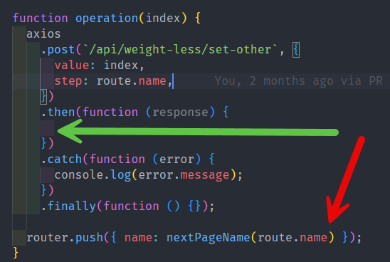

<div dir='rtl' style="text-align:right;direction:rtl">

# داکیومنت فنی سایت eat ایزیلی

در این داکیومنت راهنمای کافی برای ادامه توسعه سایت در آینده قرار میگیرد.

- برای ساخت برنامه از چه استک‌هایی استفاده شده؟
- چه شخص یا تیمی می‌تواند توسعه برنامه را ادامه دهد؟
- انتقال و تحویل پروژه
- اجرای برنامه در محیط لوکال برای توسعه
- اجرای برنامه در محیط پروداکشن
- اعمال تغییرات انجام شده در محیط پروداکشن
- جدول ها
- ساختار کلی برنامه
- تغییر رفتار ارسال داده ها به سرور
- تغییرات در فرمول و محاسبه
- جابه‌جایی یا غیر فعال سازی سوالات آزمون و تغییر سوالات
- ویرایش یک صفحه شامل متن و عکس ها
- ایجاد یک سوال یا صفحه جدید

## برای ساخت برنامه از چه استک‌هایی استفاده شده؟

برای فرانت از vue.js و tailwind استفاده شده است و برای بکند از Laravel 11 همچنین پروژه به صورت داکرایز شده می‌باشد.

## چه شخص یا تیمی می‌تواند توسعه برنامه را ادامه دهد؟؟

شخص یا تیمی که با استک‌های استفاده شده آشنایی داشته باشند.

- Vue.js
- Tailwind
- Laravel
- git
- آشنایی با Docker

## انتقال و تحویل پروژه

ریپازیتوری گیتهاب پروژه با شما شیر می‌شود همچنین کد ها به صورت زیپ شده تحویل داده می‌شود. میتوانید یک ریپو گیت جدید ساخته و پروژه رو push کنید یا از ریپو گیت یک کلون بگیرید.

## اجرای برنامه در محیط لوکال برای توسعه

برای اجرای برنامه در محیط لوکال باید داکر و Node.js روی سیستم شما نصب باشد. ابتدا برنامه را از آدرس گیت کلون کنید.

با دستور زیر فایل .env.example را کپی کرده و اسم آن را به .env تغییر دهید.

``` bash
cp .env.example .env
```

با تغییر فایل .env میتوانید قسمت های مختلف مثل اسم برنامه یوزرنیم و پسورد دیتابیس و ... رو تغییر دهید.

سپس دستور زیر را برای اجرای پروژه بزنید تا داکر ایمیج های مورد نیاز را دانلود و اجرا کند. بار اول این کار کمی طول می‌کشد.

``` bash
docker compose up -d
```

سپس دستورات زیر را به ترتیب بزنید

``` bash
docker compose exec -it -u 1000 laravel composer install

docker compose exec -it -u 1000 laravel php artisan key:generate

docker compose exec -it -u 1000 laravel php artisan migrate
```

سپس دستور زیر را برای نصب نیازمندیهای Node بزنید

``` bash
npm i
```

سپس دستور زیر را بزنید تا vite برنامه را در حالت توسعه اجرا کند.

``` bash
npm run dev
```

## اجرای برنامه در محیط پروداکشن

اجرای برنامه در محیط پروداکشن همانند محیط لوکال است با این تفاوت که بعضی از مقادیر فایل env متفاوت است. یعنی از نام کاربری و پسورد های قویتری باید استفاده شود. همچنین مقدار APP_ENV باید با production باشد.

همچنین به جای دستور `docker compose up -d` در محیط local باید دستور زیر را بزنید

``` bash
docker compose -f docker-compose-prd.yml up -d
```

و در آخر به جای دستور `npm run dev` باید دستور زیر را بزنید

``` bash
npm run build
```

سایر دستورات مشابه با اجرا در لوکال است

## اعمال تغییرات انجام شده در محیط پروداکشن

بعد از هر تغییر در کد ها باید تغییرات را کامیت کرده و سپس پوش کنید که تغییرات در ریپازیتوری گیت پوش شود. سپس با ssh به سرور کانکت شده و در آدرس ریپازیتوری تغییرات را pull کنید.

اگر تغییرات شما در کد ها مربوط به فایل های فرانت. از جمله فایل های vue و js باید باید دستور زیر را بزنید

``` bash
npm run build
```

در غیر این صورت نیازی به دستور دیگری نیست

## جدول ها

جدول های اصلی برنامه

- جدول guests : هر کاربری که وارد سایت می‌شود یک کد یکتا برای آن تولید می‌شود که در استوریج مرورگر ذخیره می‌شود. آن کد یکتا در این جدول ذخیره می‌شود و سایر اطلاعات به صورت رابطه ای با همین جدول نگه داری می‌شود.
- جدول data : در این جدول دیتا های اصلی مثل جنستی، سن، وزن و بعضی از دیتا های دیگر مثل وضعیت آزمون و ... در این جدول ذخیره می‌شود.
- جدول other_data : در این جدول سایر دیتا ها که در صفحات آزمون پرسیده می‌شود ذخیره می‌شود.
- جدول payments : در این جدول اطلاعات مربوط به پرداخت ها قرار میگیرد.
- جدول users : در این جدول یوزر ادمین قرار دارد که در شروع برنامه در جدول seed می‌شود. و می‌توان با مشخصات آن وارد پنل ادمین شد.
- جدول user_actions : در این جدول مواردی مثل کد otp و ... قرار می‌گیرد

## ساختار کلی برنامه

هر کاربر با وارد شدن به سایت یک کد یکتا به عنوان guest id دریافت می‌کند که در ستوریج مرورگر به اسم gid ذخیره می‌شود. و توسط اون کد این کاربر شناسایی می‌شود. و میتواند آزمون را شروع و مراحل را ادامه دهد.

در ابتدای آزمون کاربر صفحه ها و اطلاعات آن را از فایل `config/weightLess.php` دریافت می‌کند و طبق آن صفحات را پشت هم به کاربر نشان می‌دهد.

صفحات اولیه که شامل دیتای اصلی می‌شوند مانند سن، جنسیت، قد، وزن، شماره و ..روند متفاوتی دارند و نحوه ارسال و ثبت اطلاعات آنها در جدول مشابه است ولی سایر صفحات روند یکسان و مشابهی دارند که با نگاه کردن به ساختار صفحات و کد ها متوجه آنها شده و میتوانید صفحات جدید را طبق همین روند پیاده سازی کنید.

در انتها وقتی کاربر تمام اطلاعات را وارد و ثبت کرد کاربر وارد صفحه آنالیز می‌شود. در آن صفحه برنامه به سرور درخواست آنالیز بر اساس اطلاعات را ارسال می‌کند. در فایل `app/Services/TestAnalyzeService.php` آنالیز طبق فرمول انجام می‌شود و همچنین نتیجه آنالیز در دیتابیس نیز ذخیره می‌شود تا موقع خروجی اکسل بتوان از آنها استفاده کرد.

## تغییر رفتار ارسال داده ها به سرور

در حال حاضر برای اینکه برنامه سریع به نظر برسد هر بار که کاربر گزینه ای را انتخاب می‌کند برنامه منتظر پاسخ سرور نمی‌ماند و به صفحه بعدی می‌رود. این ممکن است در مواردی مشکل ایجاد کند. یعنی اگر اینترنت کاربر ضعیف باشد و دیتا به هر دلیلی به سرور نرسد یا اینکه کاربر خیلی سریع گزینه ها را وارد کند ممکن است اطلاعاتی ثبت نشود. برای حل این مشکل می‌توان در صفحات آزمون طبق عکس زیر خط زیر را به متد then انتقال دهید.



## تغییرات در فرمول و محاسبه

اگر بخواهید فرمول آنالیز را تغییر دهید تنها چیزی که لازم است تغیر دهید فایل `app/Services/TestAnalyzeService.php` است. در این فایل متد هایی وجود دارد که هر کدام وظیفه محاسبه یک پارامتر را داند. برای مثال یک متد برای محاسبه راست مغز بودن و دیگری برای محاسبه درصد چپ مغز بودن.

## جابه‌جایی یا غیر فعال سازی سوالات آزمون و تغییر سوالات

برای این که ترتیب سوالات آزمون را تغییر دهید کافیست فایل `config/weightLess.php` را تغییر دهید که آرایه ای از مراحل آزمون هست کلید های این آرایه دقیقا نام route ها در فایل `resources/js/vue/router.js` است. همچنین هر آرایه شامل دو فیلد question و options هست که با تغییر آنها می‌توانید متن سوالات و گزینه ها را در صفحات آزمون تغییر دهید.

برای جابه‌جایی ترتیب سوالات کافیست آرایه های آزمون را جابجا کنید.

نکته: دقت کنید ترتیب سوالات حساس را حفظ کنید یعنی اگر صفحه نمایش چارت را قبل از صفحه تغییر قد و وزن قرار دهید برنامه با مشکل مواجه می‌شود.

## ویرایش یک صفحه شامل متن و عکس ها

اگر فقط بخواهید سوال و متن گزینه ها را عوض کنید همانطور که بالاتر توضیح داده شد باید فایل `config/weightLess.php` را تغییر دهید. اما اگر لازم باشد تغییرات بیشتری اعمال کنید شامل تغییر در ساختار یا عکس ها باید مستقیم فایل را ویرایش کنید. تمام صفحات آزمون در مسیر `resources/js/vue/pages/weight_less/` قرار دارند که می‌توانید آنها را ویرایش کنید.

برای این که بفهمید اسم فایل هر صفحه کدام است می‌توانید از فایل `resources/js/vue/router.js` کمک بگیرید.

## ایجاد یک سوال یا صفحه جدید

برای ایجاد یک صفحه جدید لازم است که به vue مسلط باشید ولی روند کلی به این صورت است.

- ابتدا یکی از صفحه هایی که بیشترین شباهت را دارد کپی کنید.
- اسم مناسب برای فایل انتخاب کنید. الگوی نامگذاری را طبق صفحه های دیگر رعایت کنید.
- در فایل `resources/js/vue/router.js` یک روت جدید ایجاد کنید حتما باید برای روت یک name بگذارید. الگوی نامگذاری ها را مشابه با روت های دیگر رعایت کنید.
- در فایل `config/weightLess.php` یک کلید هم نام با نام صفحه در فایل `resources/js/vue/router.js` بسازید. و محتویات آن را طبق سایر المنت های آرایه وارد کنید و از آنها در صفحه استفاده کنید.

</div>
